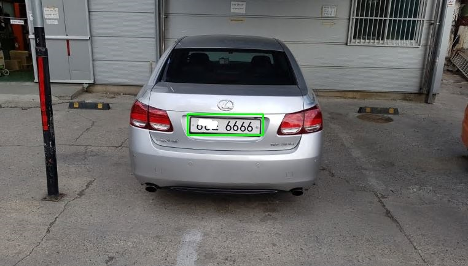
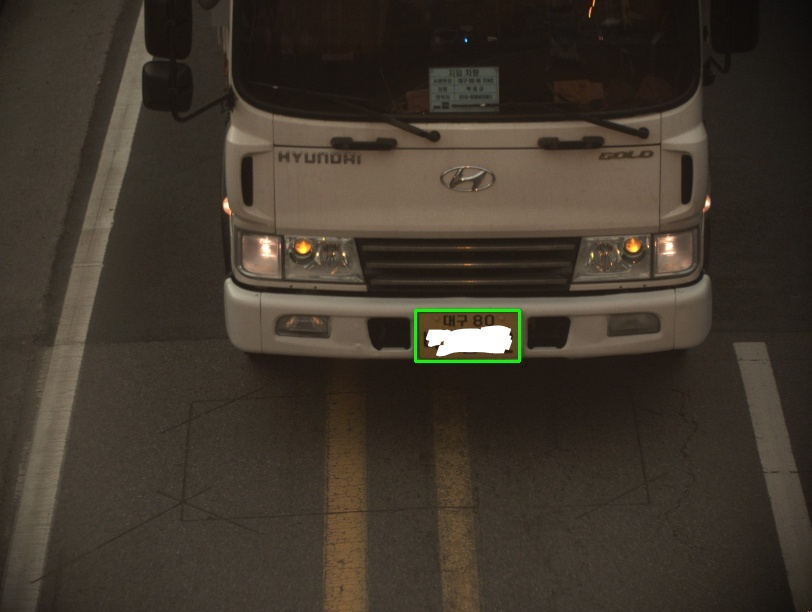

# Tensorflow License Plate Detector
MobileNetV2-SSDlite based KOR license plate detector with pretrained model provided

## Dependencies
Python
Tensorflow == 1.14.0
OpenCV-Python

## Results

## Usage
### Run detection from image
  python lp_detect_image.py (imagefile)
### Run detection from USB Camera
Here is an example to use camera ID = 0
'''  python lp_detect_cam.py  '''
if you want change camera ID
'''  ./lp_detect_cam.py
  video_capture = cv2.VideoCapture(**NUM**) '''

## License
Usage of the code and model by yeephycho is under the license of Apache 2.0.

The code is based on GOOGLE tensorflow object detection api. Please refer to the license of tensorflow.
